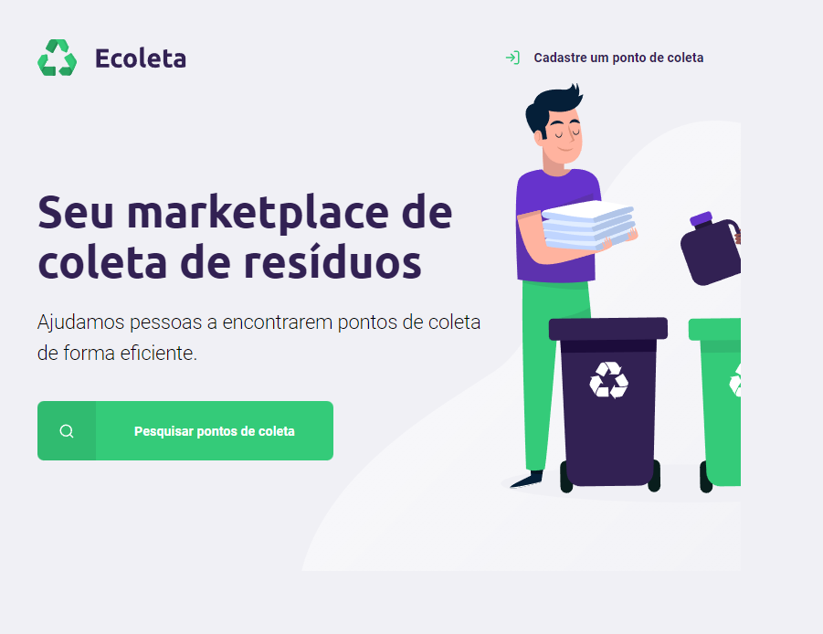
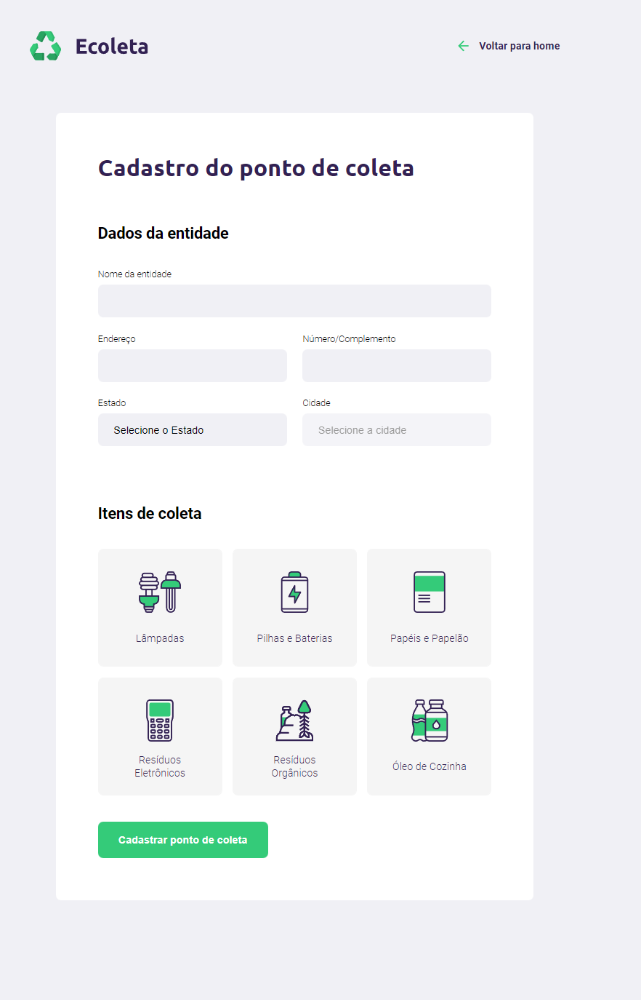
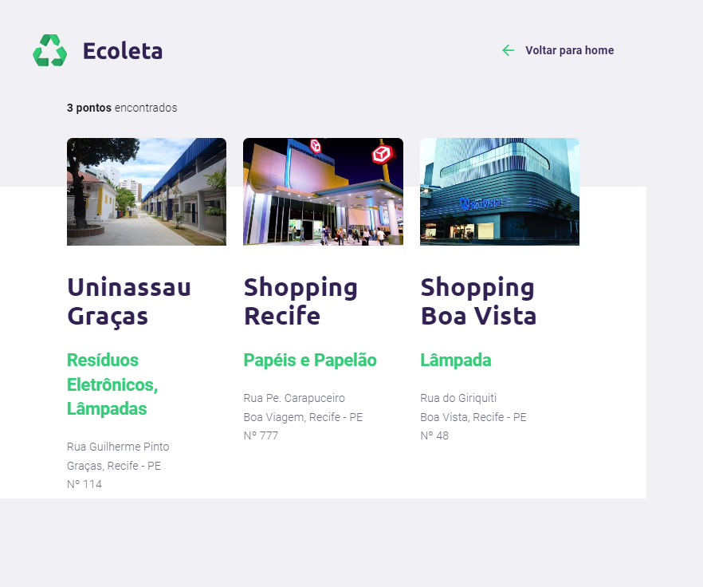

# Ecoleta

## SOBRE 🔖

O Ecoleta é uma aplicação Web para ajudar pessoas a encontrarem pontos de coleta para reciclagem.

## Resultado WEB ✔️

>Tela Home

>Tela de Cadastro

>Pontos de Coleta

## COMO USAR 💻

- Possuir o VSCODE instalado 
- Dentro do VSCODE instalar e extensão "Live Server"
- No arquivo "index.html" selecionar a opção "Open with live server"

## Tecnologias 👨🏻‍💻

- HTML
- CSS
- JavaScript

## Contato 📲

- fabianogfandrade@gmail.com
- (81) 9 9128 4940 
